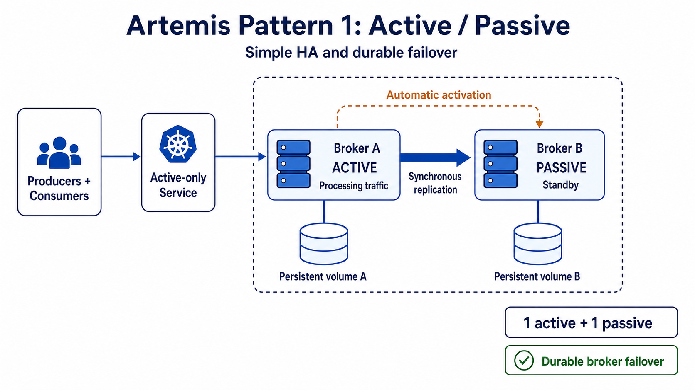

# ADR: Environment and traffic-class Artemis cells

- Status: Accepted topology baseline; capacity remains a runtime gate
- Date: 2026-07-30
- Decision owners: Platform Engineering

## Context

Every logical environment needs durable broker failover, while PP and PR also
serve external clients. Production observations include approximately 8,300
attached consumers, a 379,000-message overnight sample, a possible
1,000,000-message burst, and retained backlog. A shared broker for all traffic
would couple security, capacity, replay, management, and maintenance effects.
Creating a pair for every team would instead multiply infrastructure and
operations without evidence that every workload needs isolation.

## Decision

Use workload cells composed of one active broker, one passive broker, and one
persistent volume per peer:



| Logical environment | Internal pair | External pair | Batch pair |
| --- | --- | --- | --- |
| PE | Required | None | None |
| PP | Required | Required | Disabled future placeholder |
| DM | Required | None | None |
| PR | Required | Required | Disabled future placeholder |

All environments and clients are hosted inside the enterprise network.
“External” identifies the client/application trust and traffic boundary in PP
and PR; it does not authorize an internet-facing broker listener.

Pairs remain independent: they do not share journals, queues, services,
credentials, management endpoints, or message-cluster connections. The
environment-local ApplicationSet derives a unique Hawtio/Jolokia host and
matching Keycloak redirect URI from each topology entry.

Batch stays disabled until measured overnight, replay, or long-running traffic
shows that isolation is needed and PP validation passes. A dedicated pair for
another team or workload is an exception based on capacity, security,
management blast radius, recovery objectives, or maintenance cadence—not a
default team entitlement.

## Storage envelope

PP and PR internal, external, and future batch entries allocate 500 GiB to
each peer. The broker disk guardrail is 80 percent, leaving 400 GiB before
flow control. The provisional capacity case uses 2,000,000 stored messages
with a 128-KiB body:

```text
2,000,000 x 128 KiB = approximately 244 GiB
```

The approximately 244 GiB is payload only. The remaining space is reserved for
message properties, broker metadata, journal and paging overhead, temporary
growth, and operational headroom. Replication means both peers must
independently hold the full backlog; their PVC sizes are not additive.

This envelope is accepted only after the capacity profile passes with actual
production message-size distributions, enqueue/dequeue timing, acknowledgement
behavior, paging, replication, and failure during backlog. If measured total
storage crosses the 400-GiB guardrail or retention overlaps multiple burst
windows, increase the volume or reduce the retention envelope before
promotion.

## Queue-policy boundary

Automatic per-source dead-letter resources remain enabled by the platform.
Automatic expiry resources are available but disabled until an owner supplies
a retention requirement. Permanent application queues remain declarative.

The current chart applies dead-letter, expiry, redelivery, paging, and
auto-creation behavior through one catch-all address setting per pair. Teams
may propose policy changes later, but different policies for teams sharing one
pair require a reviewed multi-match chart feature and queue catalog. Hawtio or
raw broker-property edits are not the configuration interface.

## Consequences

The topology keeps the normal case small and understandable, preserves the
existing PP/PR external boundary, gives management actions a pair-local blast
radius, and leaves a tested expansion path for batch traffic. It costs two
broker pods and two PVCs for every enabled cell, and shared ZooKeeper remains a
coordination failure domain as documented in the ZooKeeper topology ADR.
