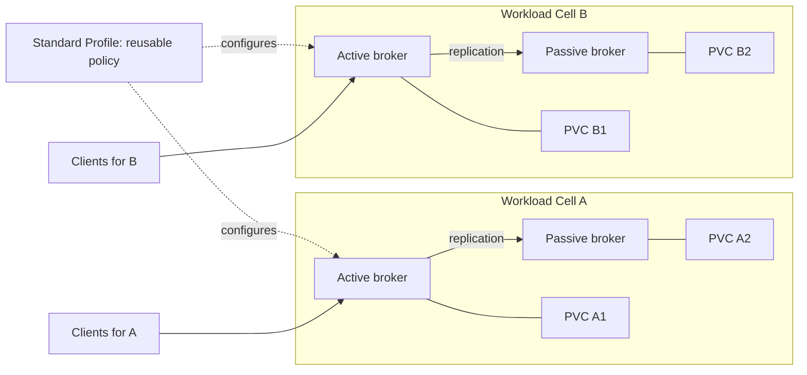
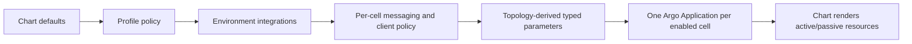
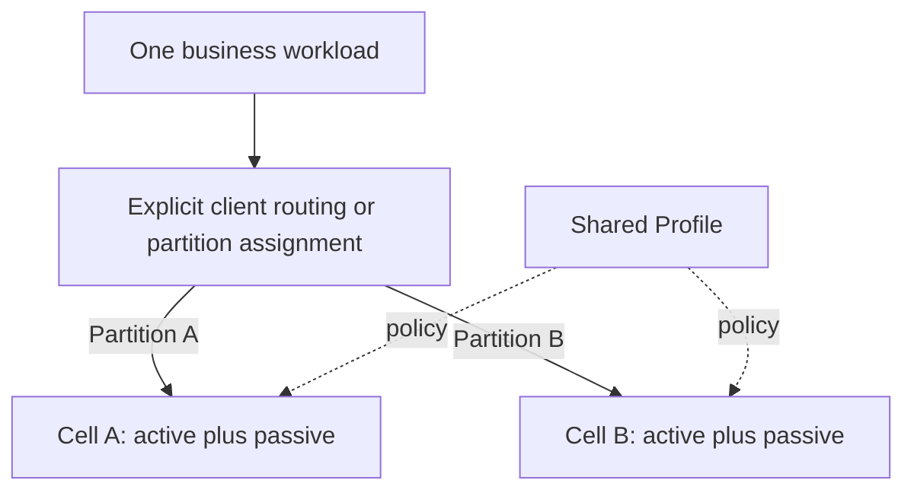
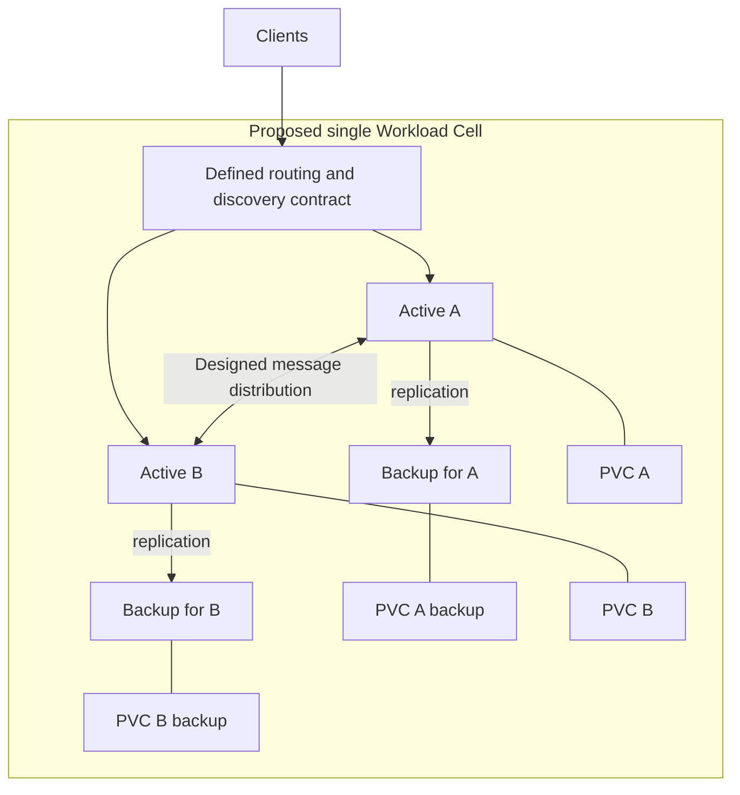
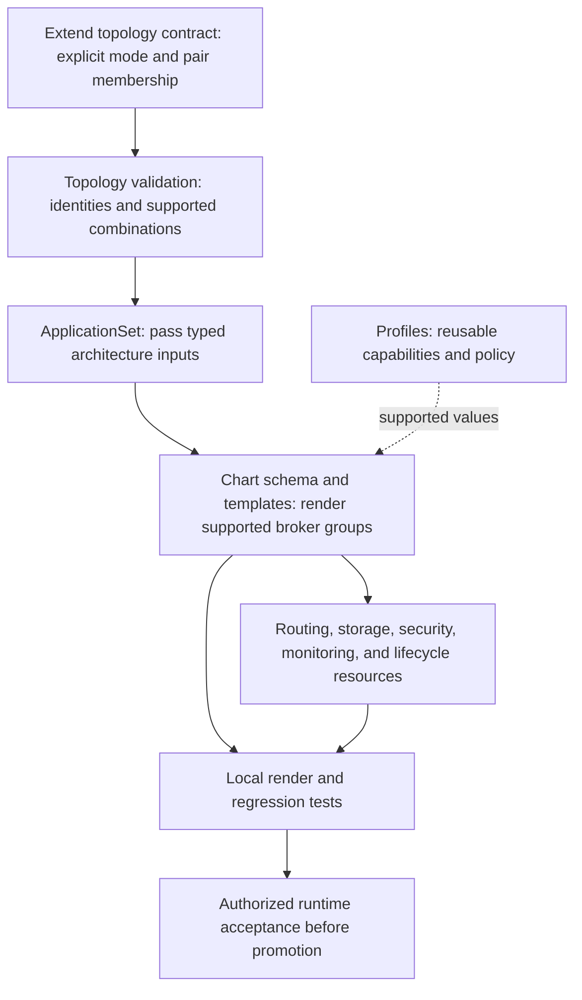
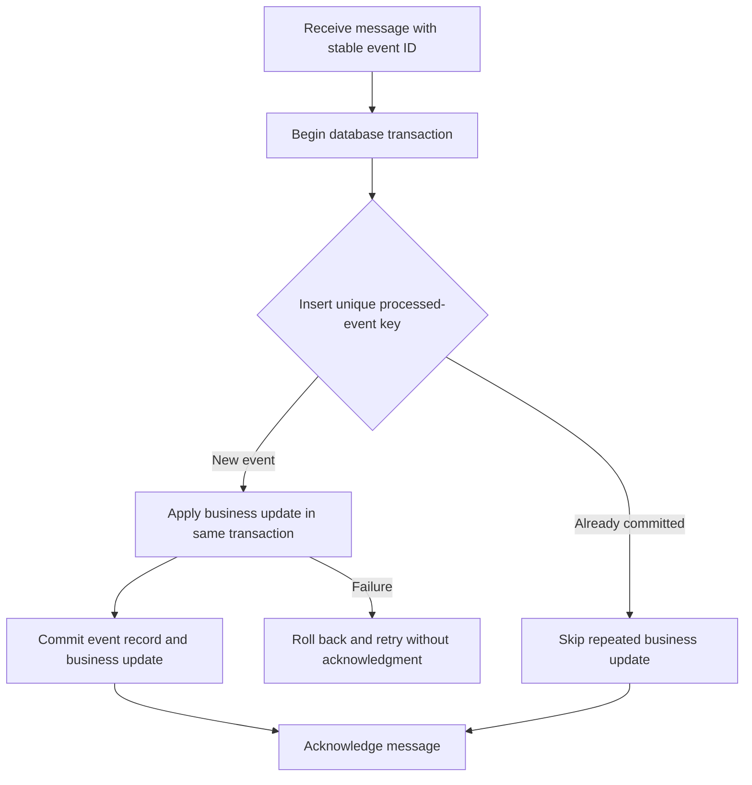
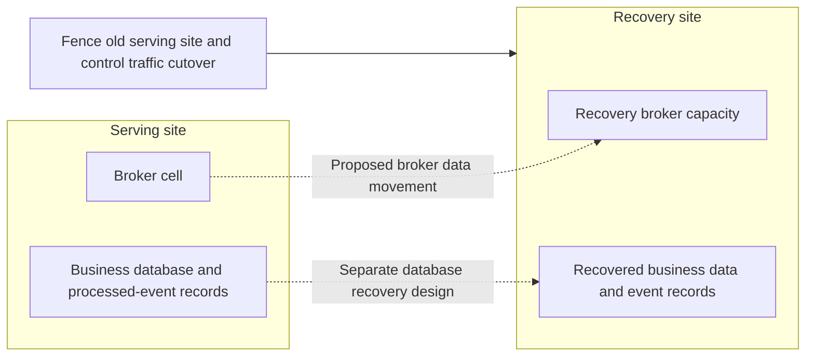

# Discussion: Profiles and future Workload Cell architectures

- Discussed: 2026-09-25
- Status: Handoff discussion and future design options; not an accepted architecture change.
- Scope: Explain the existing configuration boundaries and where a future
  multiple-active design would require implementation work.

## Why this note exists

We discussed whether Profiles are the mechanism for a workload-cell
architecture, and whether selecting a Profile could give a specific cell
multiple active brokers. Profiles configure reusable capabilities and operating
policy. Topology defines the cells. Today, a Profile cannot turn a cell into a
multiple-active broker cluster.

The existing [Workload Cell topology ADR](adr-workload-cell-topology.md) and
[operator HA ADR](adr-operator-ha.md) remain authoritative. This note records
the distinction and possible evolution paths so a future team can revisit the
question without treating it as an implemented feature or an approved decision.

## Current architecture

A Workload Cell is one independently managed active/passive pair, with a
persistent volume per peer. Cells have separate messaging state, services,
credentials, and management endpoints. Shared platform dependencies, including
ZooKeeper, still create broader failure domains.



Reusing a Profile does not connect cells or make their queues shared. The
passive provides failover capacity; its storage is not additional independent
backlog capacity for the active.

The configuration layers are applied in this order; later layers win for
supported values, with validation enforcing ownership boundaries:



| Layer | Owns today |
| --- | --- |
| `gitops/argocd/topology/<environment>.yaml` | Cell identity, sizing, Profile selection, approved feature selections, and enablement. |
| `gitops/argocd/profiles/<profile>/` | Reusable protocol and operating-policy defaults and the approved feature interface. |
| `gitops/environments/<environment>/artemis-values.yaml` | Environment-wide platform integrations. |
| `gitops/workloads/<environment>/<cell>/artemis-values.yaml` | Cell-specific listeners, destinations, and client access policy. |
| `gitops/charts/artemis-ha/` | Supported resource behavior and the active/passive implementation. |

The [standard Profile contract](../argocd/profiles/standard/profile.yaml)
protects HA, coordination, durability, identity/topology, storage sizing, and
broker version from Profile ownership. The current
[broker template](../charts/artemis-ha/templates/activemqartemis.yaml) renders
`deploymentPlan.size: 2` and requires a unique coordination ID per HA pair.
Its `clustered: true` setting does not mean this repository supports multiple
active brokers in a cell. Increasing a pod count alone is not an implementation
of the proposed design.

## Option A: More independent cells for one workload

If the workload can be divided into explicit partitions, additional cells can
reuse the same Profile while retaining the existing active/passive architecture.
This fits the existing cell shape. The specific partition identities must also
fit the topology validator, or that contract must be extended deliberately.



The repository work starts with topology entries and matching workload values
files. Each cell needs its own identity, coordination ID, storage, endpoints,
and access configuration. Routing ownership and client configuration must be
defined as part of the change. Adding cells alone does not distribute messages,
move an existing backlog, or combine identically named queues across cells.
Ordering and recovery expectations must be defined per partition.

## Option B: Multiple active brokers inside one cell

This would change the current meaning of Workload Cell. A possible target is a
cell containing multiple active/passive pairs, with the actives connected for
an explicitly designed message distribution policy. The diagram is conceptual;
it is not a verified ArkMQ configuration or a deployment recipe.



This example has two active brokers and two backups, with four separate
volumes. Message distribution between actives and failover replication are
different relationships. The team must specify queue placement, consumer
behavior, ordering scope, duplicate handling, and recovery before choosing
the implementation. A common endpoint alone does not resolve those questions.

## How the codebase would change for Option B

Keep the architecture choice explicit in topology. Profiles can continue to
supply compatible operating policies. Any future compatibility restriction
between a Profile and a topology mode should be validated.



| Area | Required design or implementation work |
| --- | --- |
| [Topology](../argocd/topology/) and [ApplicationSet composition](../argocd/bootstrap/) | Define a versioned, typed architecture interface; preserve existing cells' behavior; decide whether one cell Application owns several broker resources. No proposed field names are supported yet. |
| [Chart](../charts/artemis-ha/) | Extend values and schema; implement broker group membership, backup relationships, coordination identities, discovery, and inter-broker connections. Verify the selected operator and broker versions support the intended arrangement. |
| [Workload configuration](../workloads/) | Express destination placement and routing policy through reviewed typed fields if required. Decide which policy is cell-wide and which is pair-specific. |
| Chart services, network policy, storage, and security | Define client endpoints, allowed inter-broker traffic, persistent resource identities, placement, authorization, and management access for every member. Review private listener and Hawtio inventories. |
| Chart monitoring and [runbooks](runbooks/) | Replace assumptions of one active and one replication relationship per cell with member-aware health, failover, maintenance, backup/restore, and retirement procedures. |
| [Topology validator](../scripts/validate-topology.sh), [GitOps tests](../tests/), and [chart fixtures](../charts/artemis-ha/tests/) | Test legacy rendering, valid new compositions, invalid combinations, identity collisions, and resource ownership. |
| [Performance harness](../../performance/) | Add evidence for distribution, backlog behavior, member failure, network partitions, recovery, and the agreed ordering/duplicate guarantees. |
| [Domain vocabulary](../../CONTEXT.md), ADRs, and [implementation spec](implementation-spec.md) | Accept the revised cell definition and ownership boundaries before making the new architecture a supported option. |

Whether to extend `artemis-ha` or introduce a separate chart is an open design
decision. Base it on the resulting resource and lifecycle differences; avoid
turning a Profile into an unvalidated collection of raw broker properties.

## Additional capabilities and tools

Multiple actives primarily address broker capacity. Duplicate-safe business
processing and disaster recovery need separate designs, including for the
current single active/passive pair. Another messaging product is not inherently
required: Artemis already provides clustering and message distribution, with
each active managing its own messages and connections. See
[Artemis clustering](https://artemis.apache.org/components/artemis/documentation/latest/clusters.html).

| Capability | Proposed implementation responsibility |
| --- | --- |
| Broker clustering | Extend the chart for member discovery, inter-broker connections, distribution policy, and backup relationships. |
| Safe activation | Extend the existing ZooKeeper coordination design with pair-specific identities and evidence for quorum loss, fencing, and network partitions. More than one active per cell is intentional; two peers active for the same HA pair is not. |
| Client routing and recovery | Define and test discovery, endpoints, failover, retry backoff, and jitter for every supported protocol/client combination. |
| Duplicate-safe business processing | Application teams implement idempotency, usually in their existing business database; the broker platform cannot guarantee business effects alone. |
| Disaster recovery | Provide a separate recovery environment, data movement, traffic cutover, backups, restoration, and reconciliation. |
| Operational evidence | Extend member-level metrics, dashboards, alerts, and failure tests. Track client and application outcomes as well as broker health. |

A new external load balancer, deduplication service, or coordination product
is not an automatic prerequisite. Select tools only after defining the missing
capability. The upstream links here describe capabilities, not verified support
in this repository: check the selected [Platform Release](../releases/current.yaml)
and operator compatibility before implementing them.

## Duplicate delivery versus duplicate business processing

Multiple actives should distribute work according to an explicit routing
contract. They should not each independently execute every work-queue message.
Intentional publish/subscribe fan-out is a different requirement.

Duplicate handling has two layers:

1. **Broker receipt:** a producer or broker bridge can resend after losing a
   confirmation. Artemis supports duplicate IDs and a bounded, per-address
   duplicate cache. Persistence, cache capacity, retry duration, and routing
   must be tested. Do not assume independent active brokers share a global
   duplicate ledger. See [Artemis duplicate detection](https://artemis.apache.org/components/artemis/documentation/latest/duplicate-detection.html).
2. **Business effects:** a consumer can commit a database update and crash
   before acknowledging the message. The broker can then redeliver it even
   though the business action already succeeded. Broker duplicate detection
   does not close this application transaction gap.

The recommended application pattern is a stable business event ID plus a
processed-event record committed atomically with the business update:



Use a unique key scoped to the logical consumer and event, so intended
subscribers can each process the event. Concurrent consumers must resolve
duplicates through database constraints and transaction semantics, not a
check-then-insert race. A failed or rolled-back transaction must not leave a
record that incorrectly suppresses processing. Retain records for the agreed
retry, replay, and recovery window.

External API calls require an idempotency contract at the destination or a
durable workflow that reconciles uncertain outcomes. A transactional outbox
can durably record outgoing work with the business update, but its delivery
still needs duplicate handling. See the
[idempotent consumer pattern](https://github.com/MicrosoftDocs/architecture-center/blob/main/docs/patterns/idempotent-consumer.md)
and [transactional outbox guidance](https://docs.aws.amazon.com/prescriptive-guidance/latest/cloud-design-patterns/transactional-outbox.html).

Acceptance must inject failures before and after business commit and broker
acknowledgment, including concurrent duplicates and replay after recovery.
Measure duplicate deliveries separately from duplicate business effects.

## High availability and disaster recovery

| Failure scope | Required protection |
| --- | --- |
| One active broker fails | Its synchronized backup activates and clients reconnect. |
| A node or availability zone fails | Surviving coordination quorum, appropriate peer placement, accessible storage, and tested client recovery. |
| An entire cluster or site fails | Separate recovery capacity, broker and application data recovery, traffic cutover, and reconciliation. |
| Corruption or accidental deletion | Retained, recoverable backups and a tested restore procedure; replication can propagate the unwanted change. |

Artemis mirroring is a candidate for DR data movement. Asynchronous mirroring
can leave an unreplicated tail after site loss. The team must define acceptable
data loss (recovery point objective, RPO) and time to restore service (recovery
time objective, RTO), then verify the selected versions and configuration.
See [Artemis broker connections and mirroring](https://artemis.apache.org/components/artemis/documentation/latest/amqp-broker-connections.html).



These data movement paths are not one atomic transaction. Recovery must
reconcile broker messages with business data and processed-event records;
restoring mismatched points can repeat business actions or suppress needed
work. Prevent the old site from continuing to process after cutover. Define
resynchronization and failback before switching back, and test restoration
from backups in addition to failover.

Multiple actives within one cluster do not by themselves provide site-level
DR. Likewise, multiple sites serving concurrently would require an additional
ownership and conflict-resolution design; this note does not select that
architecture. Existing local HA acceptance targets must not be presented as
proven DR guarantees.

## Evidence that would justify multiple actives

The strongest reason is that one active cannot meet agreed latency and
backlog-drain objectives, the limiting resource is demonstrably the broker,
and the workload can use parallel broker capacity. There is no universal
messages-per-second, consumer-count, or CPU threshold that mandates this
architecture.

| Measurement | Evidence supporting a change | Check before adding brokers |
| --- | --- | --- |
| p95/p99 durable-send acknowledgment latency | Repeated SLO violations correlated with broker CPU, journal I/O, or network saturation. | Storage latency, durability settings, message sizes, batching, and transactions. |
| Oldest-message age and backlog growth | Arrival rate exceeds sustainable completion rate while consumers and downstream services have spare capacity. | Slow consumers, database limits, selectors, and paused queues. |
| Burst drain time | Expected bursts cannot clear within the business deadline. | Arrival rates during draining and realistic consumer concurrency. |
| Connections, sessions, and consumers | Memory, GC, descriptors, or reconnect pressure exceed the tested single-active envelope. | Connection reuse, client backoff, idle attachment costs, and management overhead. |
| Failure and maintenance performance | Recovery or latency objectives fail during member loss, synchronization, or rolling maintenance. | Backup capacity, placement, reconnect behavior, and surviving resource headroom. |
| Per-queue distribution and contention | Independent queues or partitions can use more actives without breaking ordering requirements. | Hot keys, strict ordering, message groups, and cross-broker forwarding overhead. |

For example, draining 1,000,000 messages in 15 minutes while 500 messages per
second continue arriving requires approximately:

```text
required completion rate = arrival rate + backlog / allowed drain time
                         = 500 + 1,000,000 / 900
                         = 1,611 messages/second, before headroom
```

This is an illustrative requirement, not measured Artemis capacity. If the
broker limits completion, multiple actives may help. If consumers or a
downstream database limit completion, more brokers do not solve the problem.
Measure bytes per second and message-size distributions alongside message
rates; replication and inter-broker forwarding also consume resources.

The recorded approximately 8,300 consumers and 379,000-message overnight
backlog are validation scenarios, not proof that multiple actives are needed.
The [production workload baseline](production-workload-baseline.md) identifies
the missing measurements. The [load profile catalog](../../performance/profiles/sustained-load-profiles.yaml)
provides current test inputs and acceptance targets, not proven capacity.

Compare the existing pair, a tuned or vertically resized pair, independent
cells, and a clustered-cell candidate using the same realistic traffic.
Include durable sends, message-size distributions, steady load, bursts,
backlog, failures, and recovery. Record throughput, latency, oldest-message
age, resource use, message loss, redelivery, duplicate effects, and operating
cost. Do not assume doubling actives doubles throughput or preserves global
ordering. Set headroom from measured failure and maintenance behavior.

Favor multiple actives within one cell when a workload needs coordinated
distribution under one messaging contract and exceeds a demonstrated
single-active capacity envelope. Favor separate cells when ownership,
isolation, or explicit workload partitioning is the primary requirement.

## Questions to resolve before implementation

1. Is the requirement more throughput, more isolated workloads, or a different
   availability objective? What measured limit motivates the change?
2. Can clients partition work across independent cells, or must one cell own
   the whole messaging contract?
3. What are the required ordering, queue placement, duplicate handling, and
   failover guarantees for each protocol and client library?
4. What are the storage, backup, placement, and coordination relationships for
   each active? Which failures must the cell survive?
5. How will existing queues and backlog migrate, and what rollback remains
   possible after traffic or stored messages move?

The discussion favors retaining explicit topology ownership and using Profiles
for reusable policy. No multiple-active implementation was selected. Before
adoption, record an accepted ADR, implement the relevant contracts and tests,
and collect runtime acceptance evidence on the authorized work computer.
Local rendering validates intended configuration, not live broker behavior.
